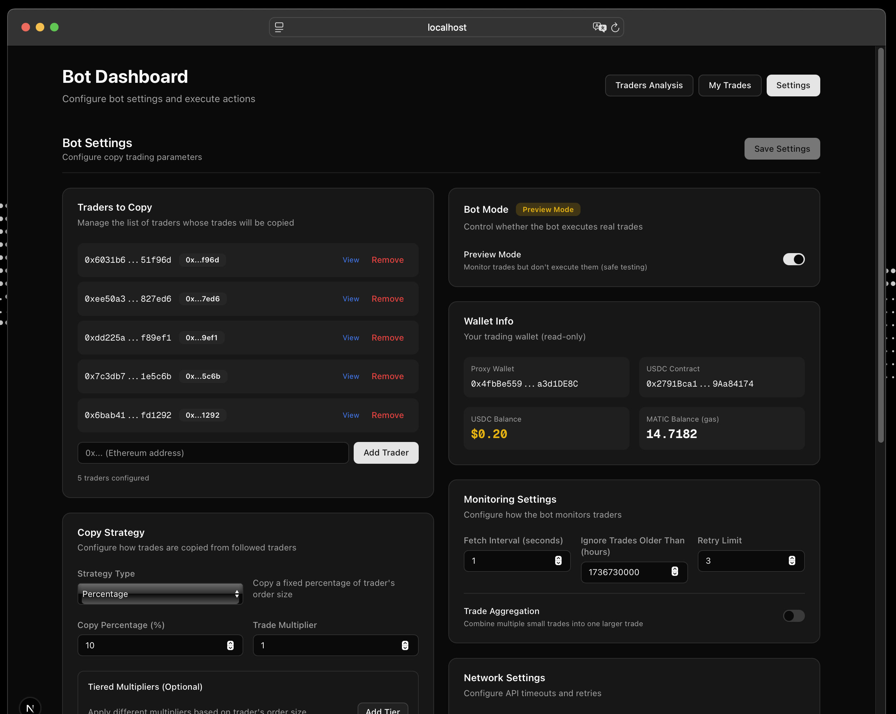

# Polymarket Copy Trading Bot

> **Copy the best, automate success.** Mirror trades from top Polymarket traders with intelligent position sizing and real-time execution.




## Why This Bot?

A copy trading bot for Polymarket that prioritizes transparency, flexibility, and real-time execution. Unlike manual trading or basic scripts, this bot offers complete automation with intelligent position sizing.

### Key Features

| Feature | Description |
|---------|-------------|
| 🖥️ Web Dashboard | Full-featured web interface for analytics, trading, and configuration |
| 📍 Position Tracking | Accurate tracking of purchases and sells across balance changes |
| ⚡ Real-time Execution | Monitors trades every second and executes instantly |
| 🔄 Trade Aggregation | Combine multiple small trades into larger executable orders |
| 👥 Multi-Trader Support | Track and copy trades from multiple traders simultaneously |
| 📊 Smart Position Sizing | Automatically scales trades based on your capital vs trader's balance |
| 📈 Tiered Multipliers | Apply different multipliers based on trade size ranges |
| 💾 MongoDB Integration | Persistent storage of all trades and positions |
| 🐳 Docker Support | Production-ready deployment with Docker Compose |

---

## Quick Start

```bash
# Clone and install
git clone <repository-url>
cd polymarket-copy-trading-bot-v1
npm install

# Configure
cp .env.example .env
# Edit .env with your wallet, traders, MongoDB, RPC

# Run
npm run build
npm run web     # Web interface at http://localhost:3000
npm start       # Or terminal mode
```

📖 **[Detailed Setup Guide →](./docs/QUICK_START.md)**

---

## Web Interface

The bot includes a full web dashboard at `http://localhost:3000` with three main views:

### Traders Analytics

- P&L and ROI charts for all tracked traders
- Monthly and daily performance trends
- Volume analysis and win rate statistics
- Sortable table with detailed metrics


**Example trader:** Check performance on [Predictfolio](https://predictfolio.com/dashboard/0x7c3db723f1d4d8cb9c550095203b686cb11e5c6b)

### My Trades

- Your copy trading performance and P&L
- Trade history with market details
- Position tracking across all markets

### Settings

- **Traders Management** — Add/remove traders to copy
- **Copy Strategy** — Configure PERCENTAGE/FIXED/ADAPTIVE mode, multipliers, tiered sizing
- **Safety Limits** — Set max/min order sizes, position limits, daily volume caps
- **Bot Settings** — Fetch interval, preview mode, trade aggregation
- **Wallet Info** — View balances (USDC, MATIC)
- **Quick Actions** — Health check, stats, close resolved positions, manual sell

All settings are saved to `.env` file. Restart the bot to apply changes.

---

## Installation

### Prerequisites

- Node.js v18+
- MongoDB (Atlas recommended)
- Polygon wallet with USDC
- POL (MATIC) for gas (~$5-10)

### Standard Setup

```bash
git clone <repository-url>
cd polymarket-copy-trading-bot-v1
npm install
cp .env.example .env
```

Edit `.env`:

```bash
USER_ADDRESSES = '0xTrader1, 0xTrader2'
PROXY_WALLET = 'your_polygon_wallet'
PRIVATE_KEY = 'your_private_key'
MONGO_URI = 'mongodb+srv://...'
RPC_URL = 'https://polygon-mainnet.infura.io/v3/...'
```

```bash
npm run build
npm run web     # Web interface
npm start       # Terminal mode
```

### Docker

```bash
cp .env.docker.example .env.docker
export $(cat .env.docker | grep -v '^#' | xargs)
docker-compose up -d
```

📖 **[Docker Guide →](./docs/DOCKER.md)**

---

## Configuration

| Variable                    | Description                       | Default    |
| --------------------------- | --------------------------------- | ---------- |
| `USER_ADDRESSES`            | Traders to copy (comma-separated) | —          |
| `PROXY_WALLET`              | Your Polygon wallet               | —          |
| `PRIVATE_KEY`               | Wallet private key                | —          |
| `MONGO_URI`                 | MongoDB connection string         | —          |
| `RPC_URL`                   | Polygon RPC endpoint              | —          |
| `COPY_STRATEGY`             | PERCENTAGE / FIXED / ADAPTIVE     | PERCENTAGE |
| `COPY_SIZE`                 | Copy size (% or USD)              | 10         |
| `TRADE_MULTIPLIER`          | Position size multiplier          | 1.0        |
| `TIERED_MULTIPLIERS`        | Size-based multipliers            | —          |
| `MAX_ORDER_SIZE_USD`        | Maximum order size                | 100        |
| `MIN_ORDER_SIZE_USD`        | Minimum order size                | 1          |
| `PREVIEW_MODE`              | Simulate without trading          | false      |
| `TRADE_AGGREGATION_ENABLED` | Combine small trades              | false      |

See `.env.example` for full configuration options.

---

## CLI Commands


```bash
npm run web              # Start web interface
npm start                # Start copy trading bot
npm run analyze          # Analyze tracked traders
npm run analyze:my       # Analyze your trades
npm run health           # System health check
npm run stats            # View positions and P&L
npm run close:resolved   # Close resolved market positions
npm run redeem           # Redeem winning positions
npm run close:stale      # Close old inactive positions
```

---

## Documentation

- **[Quick Start Guide](./docs/QUICK_START.md)** — Get running in 5 minutes
- **[Docker Guide](./docs/DOCKER.md)** — Production deployment
- **[Multi-Trader Guide](./docs/MULTI_TRADER_GUIDE.md)** — Advanced multi-trader setup
- **[Tiered Multipliers Guide](./docs/TIERED_MULTIPLIERS.md)** — Size-based multiplier configuration
- **[Position Tracking](./docs/POSITION_TRACKING.md)** — How position tracking works
- **[Simulation Guide](./docs/SIMULATION_GUIDE.md)** — Backtest strategies
- **[Funding Guide](./docs/FUNDING_GUIDE.md)** — How to fund your wallet

---

## Safety

⚠️ **Use at your own risk.** This bot executes real trades with real money.

**Best Practices:**

- Use a dedicated wallet with limited funds
- Start with `PREVIEW_MODE=true` to test
- Research traders before copying
- Monitor the bot regularly
- Set appropriate safety limits

---

## Contributing

1. Fork the repository
2. Create feature branch (`git checkout -b feature/name`)
3. Commit changes (`git commit -m 'Add feature'`)
4. Push to branch (`git push origin feature/name`)
5. Open Pull Request

---

## License

Educational and research purposes. Users responsible for compliance with local laws and Polymarket ToS.

---

**Disclaimer:** Trading involves risk of loss. Developers not responsible for financial losses.
